# DSA Design Patterns — 23 GoF Mini-Projects

> Twenty-three Gang-of-Four design patterns, each implemented as a **small, independently runnable
> mini-project** inside one Gradle build. Every pattern ships with its own `main()` (run it on its
> own) and its own JUnit 5 test. Modern Java only: `sealed` hierarchies, `record` value types,
> pattern-matching `switch`, `var`, `Stream.toList()`, and functional interfaces.

---

## 🗺️ Architecture at a glance (read this first)

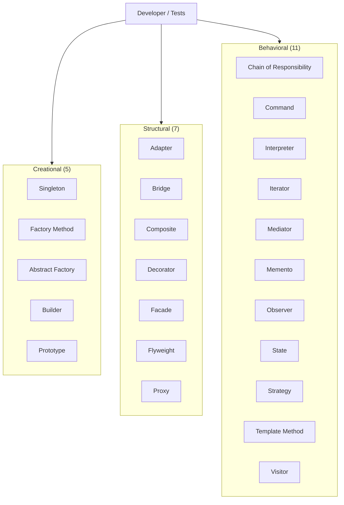

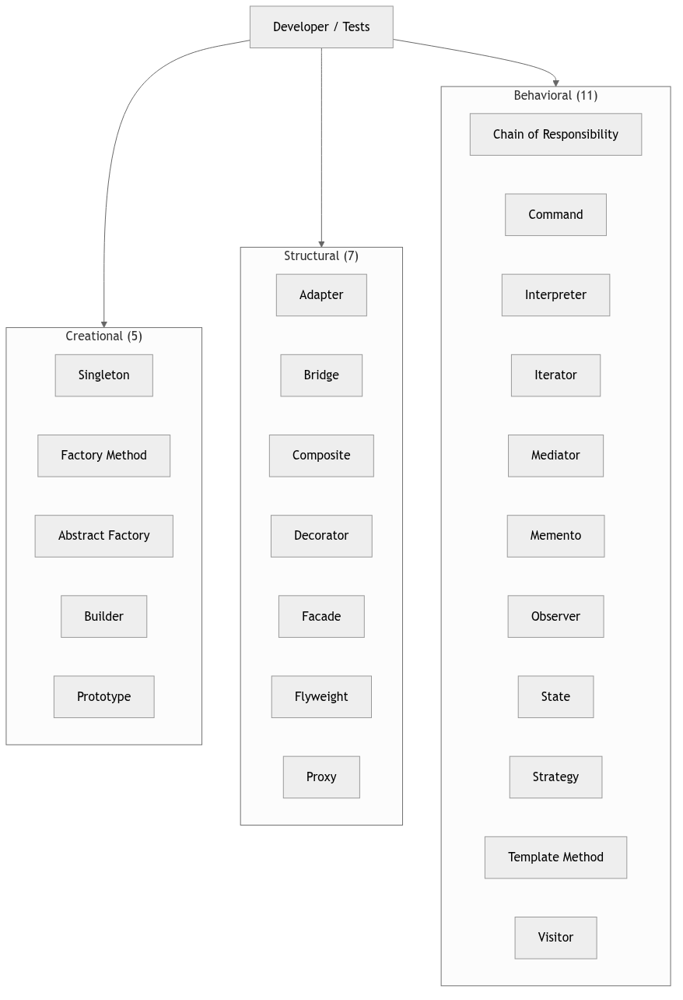

---

## 🚀 Quick start (clone → run → test)

```bash
# 1. Clone
git clone https://github.com/dbillion/dsa-design-patterns.git
cd dsa-design-patterns

# 2. Point at Java 17 (the project is tuned for sdkman's 17.0.12-graal)
export JAVA_HOME="$HOME/.sdkman/candidates/java/17.0.12-graal"
export PATH="$JAVA_HOME/bin:$PATH"

# 3. Run the full test suite (23 pattern tests, all green)
./gradlew test

# 4. Run any single mini-project on its own:
./gradlew run --args='dp.creational.singleton.SingletonDemo'
./gradlew run --args='dp.structural.decorator.DecoratorDemo'
./gradlew run --args='dp.behavioral.visitor.VisitorDemo'
```

> **Why `run --args=`?** The `application` plugin is applied, so each `*Demo` class with a
> `public static void main` becomes a standalone entry point. No IDE required — one command runs
> one pattern in isolation.

---

## 📦 What's inside — the story

This repo was built to turn the abstract GoF catalogue into **runnable, testable, modern-Java
reference code** for interview prep. Every pattern lives in its own package under
`src/main/java/dp/<category>/<pattern>/` and has a matching `*Test.java` next to it under
`src/test/java/dp/<category>/<pattern>/`.

The driving idea: **a pattern is only real when you can run it and assert its behaviour.** So each
mini-project pairs a `main()` (a 5-line demo you can watch print) with a test (the behavioural
contract, pinned down).

### Creational — *how objects get created*
| Pattern | Mini-project | Modern Java highlight |
|---|---|---|
| Singleton | `dp.creational.singleton` | `enum` singleton — serialization & reflection safe by construction |
| Factory Method | `dp.creational.factorymethod` | `sealed interface Shape` + `switch` expression dispatch |
| Abstract Factory | `dp.creational.abstractfactory` | `sealed GUIFactory` producing `record` Button/Checkbox |
| Builder | `dp.creational.builder` | Fluent builder → immutable `record Email` (`List.copyOf`) |
| Prototype | `dp.creational.prototype` | `record` clone-at-new-position |

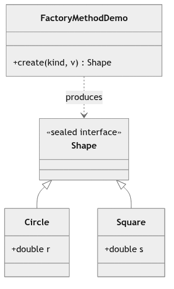
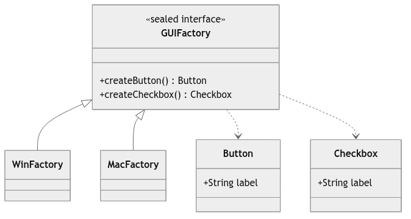
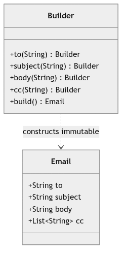

### Structural — *how classes & objects compose*
| Pattern | Mini-project | Modern Java highlight |
|---|---|---|
| Adapter | `dp.structural.adapter` | Legacy Fahrenheit sensor wrapped to a Celsius `interface` |
| Bridge | `dp.structural.bridge` | Shape decoupled from `Renderer` via composition |
| Composite | `dp.structural.composite` | `sealed Node` tree, `Stream` size aggregation |
| Decorator | `dp.structural.decorator` | `record` wrappers layering cost/description |
| Facade | `dp.structural.facade` | One-call `watch()` over subsystems |
| Flyweight | `dp.structural.flyweight` | `ConcurrentHashMap.computeIfAbsent` shared glyphs |
| Proxy | `dp.structural.proxy` | Lazy `RealImage` behind a `ProxyImage` |

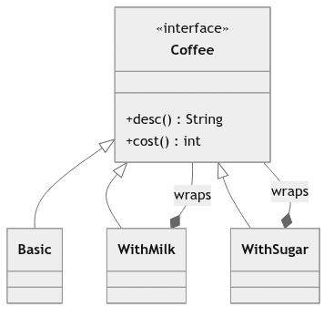
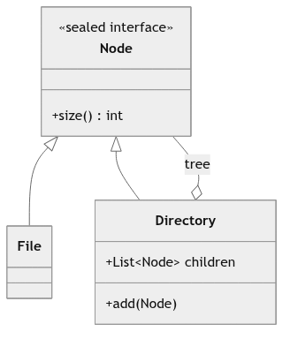
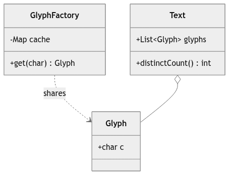

### Behavioral — *how objects cooperate*
| Pattern | Mini-project | Modern Java highlight |
|---|---|---|
| Chain of Responsibility | `dp.behavioral.chain` | `List<Handler>` tried in order, `Optional` first-match |
| Command | `dp.behavioral.command` | Undo via a `Deque<Runnable>` |
| Interpreter | `dp.behavioral.interpreter` | `sealed Expr` boolean DSL |
| Iterator | `dp.behavioral.iterator` | Custom `Iterable<Integer>` range |
| Mediator | `dp.behavioral.mediator` | `ChatRoom` central hub |
| Memento | `dp.behavioral.memento` | `record State` snapshot/restore |
| Observer | `dp.behavioral.observer` | `Consumer<String>` subscribers |
| State | `dp.behavioral.state` | `sealed State` returns next state |
| Strategy | `dp.behavioral.strategy` | `Comparator` passed as behaviour |
| Template Method | `dp.behavioral.template` | Fixed `make()`, abstract `brew()` |
| Visitor | `dp.behavioral.visitor` | `sealed Shape` + `Visitor` double dispatch |

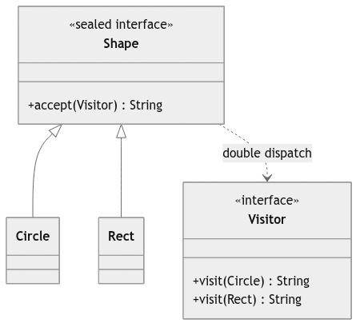
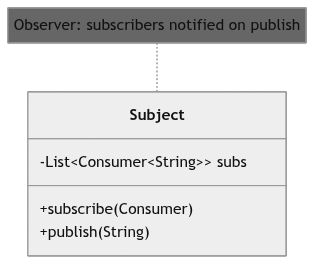
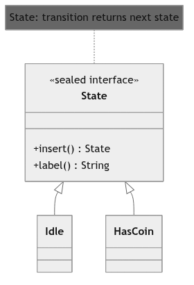

---

## 🧪 Testing

```bash
./gradlew test
```

- **23 test files**, one per pattern, all passing.
- Each test asserts the *behavioural contract*, not just "it compiles": e.g. the Decorator test
  checks layered cost (`5 + 2 + 1 = 8`) and that the description nests; the Flyweight test asserts
  `assertSame` on shared glyphs; the State test checks the transition returns the right subtype.

---

## 🗂️ Layout

```
dsa-design-patterns/
├── build.gradle
├── settings.gradle
├── gradle/wrapper/            # Gradle 8.2.1 (Java 17 compatible)
├── scripts/gen_design_diagrams.sh
├── docs/diagrams/             # rendered mermaid PNGs + .mmd sources
└── src/
    ├── main/java/dp/
    │   ├── creational/   (singleton, factorymethod, abstractfactory, builder, prototype)
    │   ├── structural/   (adapter, bridge, composite, decorator, facade, flyweight, proxy)
    │   └── behavioral/   (chain, command, interpreter, iterator, mediator, memento,
    │                      observer, state, strategy, template, visitor)
    └── test/java/dp/     # mirror of the above, *Test.java per pattern
```

---

## 🔧 Tech & conventions
- **Java 17** (sdkman `17.0.12-graal`) · **Gradle 8.2.1** · **JUnit 5.9.1**
- No `--enable-preview`: every idiom used compiles on stock Java 17.
- `sealed` + `record` + pattern-matching `switch` replace brittle `instanceof` chains.
- `List.copyOf` / `Map.copyOf` guarantee immutable returns.
- Each mini-project is self-contained: clone, `./gradlew run --args=…`, done.
